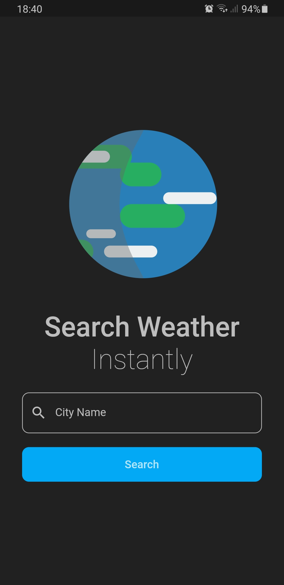

# Cities Weather App

A [Flutter](https://flutter.dev/) application for retrieving json data from API made with BLoC.


[Download APK](release/weather-bloc.apk)


## External Packages
```
dependencies:
  flare_flutter: ^1.7.1
  bloc: ^6.0.0
  flutter_bloc: ^6.0.0
  http: ^0.12.0+2
  equatable: ^0.6.1
  flutter_launcher_icons: ^0.8.1
  flutter_launcher_name: ^0.0.1
```

## Demo GIF


## Screenshots

|Main Screen|Result Screen|Error Screen|
|---|---|---|
||||
